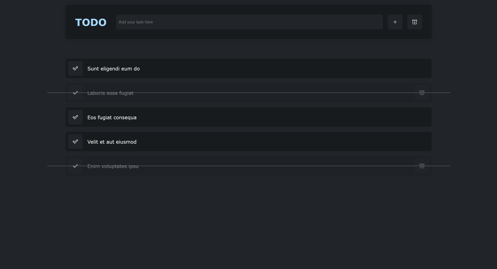

# TODO List

 

## What is this?
This is a simple todo list app that I made to learn React with TypeScript. It uses local storage to save the todo list.

 

## How to use it?
Live demo: https://todolist.opedro.dev/